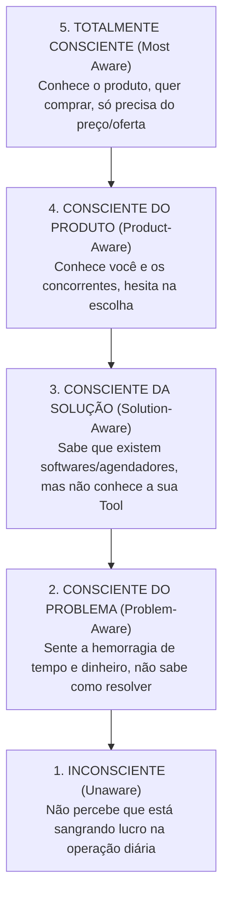

# Tratado Canônico II: A Matriz dos 5 Níveis de Consciência (Stages of Awareness)

> *"If your prospect is aware of your product and has realized that it can satisfy his desire, your headline starts to the point. If he is not aware of your product, but only of the desire itself, your headline starts with the desire. If he is not even aware of what he is seeking, but is only conscious of a vague need, your headline starts with that need."*  
> — **Eugene M. Schwartz**, *Breakthrough Advertising* (Capítulo 2)

---

## 1. A Topologia Psicológica do Prospect

O nível de consciência determina a **distância cognitiva** entre o que o cliente sabe no segundo em que você fala com ele e o momento em que ele puxa o cartão ou faz o Pix. 

Tentar vender uma solução técnica para alguém que só está sentindo a dor é o motivo pelo qual 99% das abordagens comerciais falham.

---

## 2. Dissecação Cirúrgica dos 5 Níveis

---

### Nível 1: Completamente Inconsciente (Unaware)
* **Estado Mental:** O operador está na correria do dia a dia. Ele acha normal perder mensagens, acha normal cliente faltar sem avisar e considera a desorganização "parte do ofício".
* **O que ele sabe:** Nada sobre sistemas, nada sobre funis. Só sente cansaço no final do dia.
* **O que NÃO fazer (Erro Fatal):** Falar de site, landing page, IA, software ou ferramentas. O cérebro dele desliga instantaneamente por ver isso como um custo desnecessário.
* **Como abordar:** Através de uma **Identificação de Sintoma Visceral**.
* **Exemplo de Gancho:**
  > *"Você já reparou quantas horas por semana você passa no WhatsApp respondendo as mesmas perguntas sobre preço e horário em vez de estar atendendo clientes e faturando?"*

---

### Nível 2: Consciente do Problema (Problem-Aware) — 🎯 ONDE MORA O NOSSO OURO
* **Estado Mental:** Ele sabe perfeitamente que o WhatsApp dele é um caos. Ele sabe que perdeu dinheiro ontem porque demorou para responder. Mas ele não sabe qual é a saída viável sem gastar rios de dinheiro ou contratar uma secretária física.
* **O que ele sabe:** A dor está aberta e sangrando.
* **O que ele NÃO sabe:** Que existe uma solução acessível (LP + Tool) que resolve isso por R$ 699 sem mensalidade abusiva.
* **Fórmula de Schwartz:** **Nomear a Dor ➔ Agitar a Consequência Financeira ➔ Apresentar o Caminho de Saída.**
* **Exemplo de Abordagem para a Sophia (Vendas):**
  > *"Eu sei que o seu WhatsApp fica apitando o dia inteiro com cliente querendo saber se tem horário, e se você para o corte pra responder, você perde o ritmo. O problema não é falta de cliente; é que o seu atendimento tá engolindo a sua rotina e você tá deixando dinheiro na mesa sem perceber."*

---

### Nível 3: Consciente da Solução (Solution-Aware)
* **Estado Mental:** Ele sabe que existem sites, agendadores online (como Avec, Trinks, Calendly, etc.). Mas ele tem objeções severas contra eles: *"Meus clientes acham difícil baixar aplicativo"*, *"Cobram mensalidade cara todo mês"*, *"O cliente tem que criar conta e desiste"*.
* **O que ele sabe:** As soluções convencionais existem, mas ele não gosta delas ou acha burocráticas.
* **Fórmula de Schwartz:** **Validar a insatisfação com as soluções velhas ➔ Apresentar o Mecanismo Único da sua Tool.**
* **Exemplo de Abordagem:**
  > *"Você provavelmente já viu aqueles aplicativos de agendamento que obrigam o seu cliente a baixar app, criar senha e preencher um cadastro chato — e a maioria dos clientes desiste e te chama no WhatsApp de qualquer jeito. A nossa Tool faz o contrário: o cliente clica, escolhe o horário em 10 segundos na sua página, e o agendamento pronto cai direto no seu WhatsApp, pronto pra confirmar, sem app nenhum."*

---

### Nível 4: Consciente do Produto (Product-Aware)
* **Estado Mental:** Ele já ouviu falar da sua empresa ou já viu o seu serviço. Ele quer saber: *"Por que eu fecho com você e não com o rapaz da minha cidade que faz site?"*, *"Será que funciona pra mim?"*.
* **Fórmula de Schwartz:** **Superioridade do Mecanismo Único + Quebra de Risco + Prova Social.**
* **Exemplo de Abordagem:**
  > *"O sobrinho que faz site entrega um layout estático que não faz nada. A gente entrega uma Página de Alta Conversão com a Tool de Agendamento Inteligente integrada no seu WhatsApp por um pagamento único de R$ 699, configurado e funcionando no seu ar em até 72 horas."*

---

### Nível 5: Totalmente Consciente (Most Aware)
* **Estado Mental:** Ele já entendeu, quer a solução, já confia na proposta. Ele só precisa do empurrão comercial final: valor, formas de pagamento, garantia e prazo.
* **Fórmula de Schwartz:** **Oferta Direta, Urgência e Chamada para Ação Sem Rodeios.**
* **Exemplo de Fechamento:**
  > *"São R$ 699 à vista no Pix ou em até 12x no cartão. A gente entrega sua página rodando essa semana com a agenda integrada. Tenho apenas 3 vagas de setup técnico para a sua região esse mês. Mando o link de pagamento agora?"*

---

## 3. Matriz de Triagem Rápida para o Agente Caçador de ICP

Quando o agente estiver analisando um prospect ou nicho de mercado, ele classifica o prospect de acordo com a tabela:

| Indicador Observado no Prospect | Nível Diagnosticado | Ponto de Entrada da Abordagem |
|---|---|---|
| Não usa agendador, WhatsApp sem link na bio, reclama de falta de tempo | **Problem-Aware (Nível 2)** | Focar na dor do tempo perdido e na perda de clientes |
| Usa link de WhatsApp cru na bio ("clique para agendar") | **Problem-Aware / Solution-Aware** | Focar na fricção de ter que responder a mesma coisa 20x |
| Já testou app ou plataforma pesada e cancelou | **Solution-Aware (Nível 3)** | Focar no Mecanismo Leve (sem app, direto pro zap) |
| Já pediu orçamento de site em outros lugares | **Product-Aware (Nível 4)** | Focar no diferencial da Tool inclusa por apenas R$ 699 |
