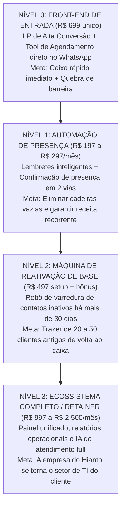

# Tratado Canônico III: Engenharia de Backend & A Heurística do 'Próximo Problema Lógico'

> *"Every time you solve a major operational problem for a business, you do not eliminate friction entirely — you simply expose the next logical constraint in their workflow. The strategist who anticipates and packages the solution to that next constraint owns the customer for life."*  
> — **Jay Abraham**, *The Sticking Point Solution & Mastermind Sessions*

---

## 1. A Heurística do 'Próximo Problema Lógico' (Next Logical Problem)

O maior segredo para criar upsells que vendem sozinhos é entender que **toda solução bem-sucedida cria um novo problema**.

Você não precisa 'inventar' produtos da sua cabeça. Você apenas observa o que acontece na vida do cliente logo após a nossa Tool de R$ 699 começar a funcionar:

```
[FRONT-END R$ 699 INSTALADO]
Problema Resolvido: O cliente agenda sozinho na página e os dados caem no WhatsApp.
           │
           ▼
[NOVO PROBLEMA REVELADO (7 a 14 dias depois)]
O dono percebe: "A agenda tá cheia de horários marcados, mas 2 ou 3 clientes por dia
esquecem de vir (no-show) ou desmarcam em cima da hora, deixando a cadeira vazia."
           │
           ▼
[UPSELL LÓGICO #1: O NO-SHOW KILLER]
Solução: Lembrete automático com confirmação de presença disparado 2 horas antes pelo WhatsApp.
Preço: R$ 197/mês a R$ 297/mês recorrente.
```

---

## 2. A Esteira de Ascensão Completa (Do Front-end de R$ 699 à Recorrência)

O nosso Arquiteto de LTV deve governar a ascensão de cada cliente através de 4 níveis de valor:



---

## 3. A Janela de Ouro do Upsell (Timing e Gatilhos)

Tentar vender o upsell no momento errado destrói a relação:
* **Cedo demais (Dia 0):** O cliente acabou de pagar os R$ 699. Se você tentar empurrar outra coisa, ele se sente enganado.
* **Tarde demais (Dia 60):** O entusiasmo inicial esfriou e ele já acostumou com a rotina.

### A Janela Ideal: O 'Momento do Primeiro Valor Real' (Dias 7 a 14)
1. **Dia 1 a 3:** Entrega impecável da LP + Tool pelo time de Dan, Carol e Alice.
2. **Dia 7:** O Arquiteto de LTV puxa os dados de uso da ferramenta (quantos agendamentos foram feitos).
3. **Dia 10:** Contato de diagnóstico consultivo (Apresentação de resultados e identificação das faltas/no-shows).
4. **Dia 12:** Apresentação da esteira de automação anti-falta. Conversão esperada: **30% a 45% dos clientes de front-end aceitam o upsell recorrente**.

---

## 4. O Cálculo Econômico da Esteira para o Caixa do Hianto

Para ver o poder real dessa esteira no faturamento da empresa:

* **Cenário:** 20 clientes fechados a R$ 699 no mês (Meta inicial de caixa rápido):
  * **Receita Imediata de Front-end:** $20 \times \text{R\$} 699 = \mathbf{\text{R\$} 13.980}$ (dinheiro limpo no bolso imediato).
* **Taxa de Conversão do Upsell de Recorrência (35%):**
  * 7 clientes aceitam o Lembrete Anti-Falta a R$ 197/mês:
  * **MRR (Receita Recorrente Mensal):** $7 \times \text{R\$} 197 = \mathbf{\text{R\$} 1.379/\text{mês}}$.
* **Ao longo de 6 meses:**
  * O caixa acumulado de front-end ultrapassa **R$ 80.000**, enquanto a receita recorrente previsível ultrapassa **R$ 8.000 a R$ 10.000 todos os meses**, sem depender de vender novos clientes todo dia.
